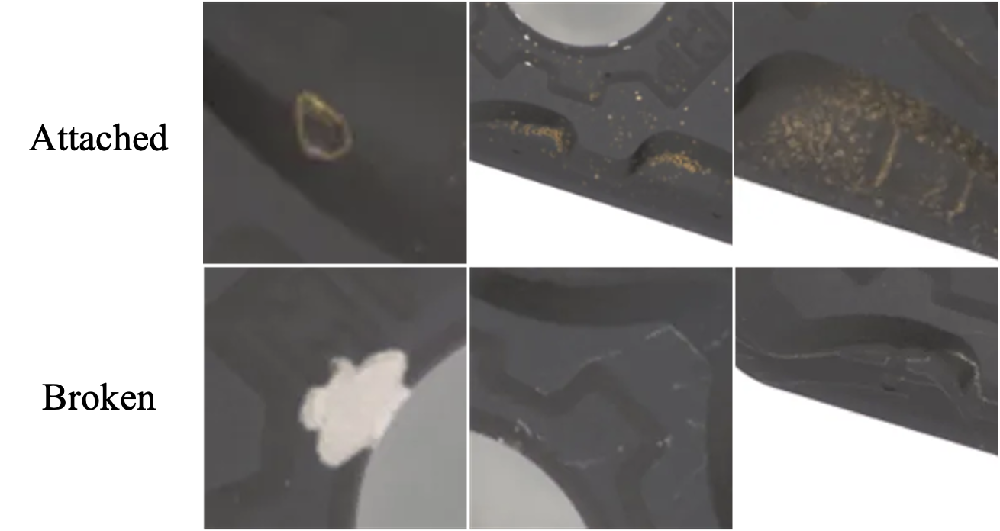
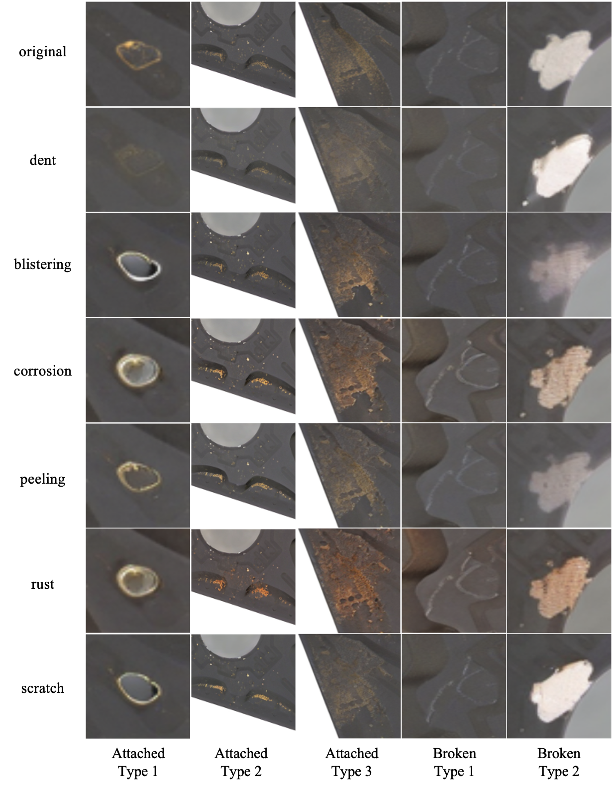
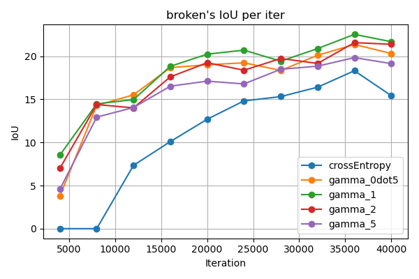
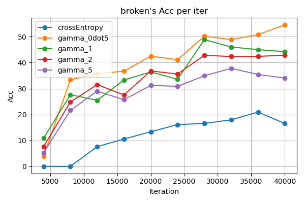
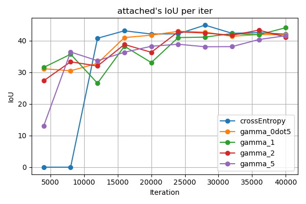
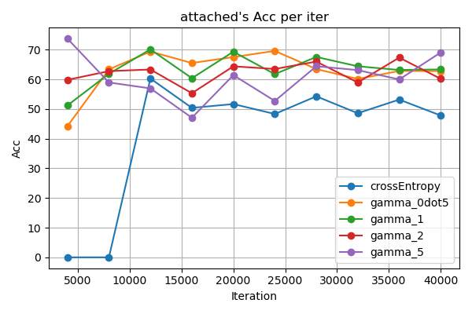
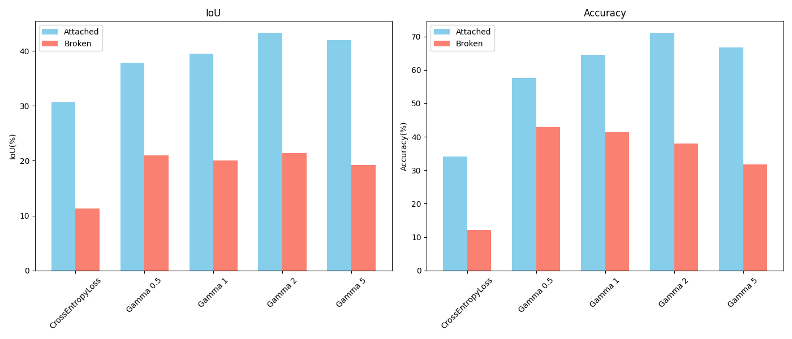

# Improving Various Segmentation model <br> by Augmentation using StableDiffusionXL <br> with Null-text Inversion + Prompt-to-Prompt

<details>
<summary style="font-size:20px; font-weight:bold;">mmSegmentation의 간단한 설명</summary>
<div markdown="1">

### | 구조
기본적으로 train.py를 살펴보면, configs 디렉토리 내의 config 파일 하나만을 가지고 학습을 진행하는 것을 볼 수 있습니다.  
이 config파일안에 데이터셋, 모델 등 모든 내용이 들어있습니다. 그럼 코드를 보면서 진행해보겠습니다.
#### * Config 파일
```python
# _base__ 리스트를 통해 
_base_ = [
    '../_base_/models/deeplabv3_r50-d8.py', #어떤 모델을 사용할건지,
    '../_base_/datasets/wta_512.py', #어떤 데이터셋 옵션을 사용할건지
    '../_base_/default_runtime.py', #(이건 기본 스케줄 옵션입니다.)
    '../_base_/schedules/schedule_40k.py' #얼마나 반복할지에 대한 정보를 가져올 수 있습니다.
]
# 아래에 작성된 것은 기존 모델의 구조를 변경하고 싶을때 사용합니다. 기존 모델의 코드에 아래코드가 오버라이딩됩니다.
# 따라서 이용하고 싶은 데이터셋에 맞도록, crop_size, num_classes를 변경하는 것이 중요합니다.
crop_size = (256, 256)
data_preprocessor = dict(size=crop_size)
model = dict(
    data_preprocessor=data_preprocessor,
    decode_head=dict(num_classes=3),
    auxiliary_head=dict(num_classes=3))

```
#### * Dataset config 파일
configs/\_base_/datasets 디렉토리 내에 위치합니다.  
해당 config 파일은 데이터셋에 대한 옵션을 담고 있습니다.  
```python
dataset_type = 'WTADataset' #어떤 타입의 데이터셋인지
data_root = './data/wta_512/' #데이터의 위치는 어디인지
...
data_prefix=dict(
            img_path='img_dir/train', seg_map_path='ann_dir/train') #wta512/img_dir: 이미지가 들어있음. wta512/ann_dir에는 레이블이 들어있음을 알려줌.
...
val_evaluator = dict(type='IoUMetric', iou_metrics=['mIoU']) #평가 방법을 정함.
test_evaluator = val_evaluator
```

#### *schedule config 파일
configs/\_base_/schedules 디렉토리 내에 위치합니다.
해당 config 파일은 학습 스케줄러에 대한 옵션을 담고 있습니다.
```python
param_scheduler = [
    dict(
        type='PolyLR',
        eta_min=1e-4,
        power=0.9,
        begin=0,
        end=40000,
        by_epoch=False)
]
```
주로 lr 감소율을 변화시킬 때 사용했습니다. end 40000을 하게 되면, 40k 에 맟줘 마지막이 lr이 0이 되도록 떨어집니다.
이 값을 키우게 되면, 모든 iteration을 돌았을 때 최종 lr의 크기가 커지게 됩니다.

### | 새로운 데이터셋 만들기
mmseg/datasets 디렉토리 내에 새로운 데이터에 대한 정보를 담은 클래스를 만들어주어야합니다.  
```python
from mmseg.registry import DATASETS
from .basesegdataset import BaseSegDataset


@DATASETS.register_module() #중요
class WTADataset(BaseSegDataset):
    METAINFO = dict(
        classes=('defect', 'attached', 'broken'), # 사용하고 싶은 데이터의 레이블이름
        palette=[[0, 0, 0], [255, 0, 0], [0, 255, 0]]) # 각 레이블에 대응되는 색상

    def __init__(self,
                 img_suffix='.png',
                 seg_map_suffix='.png',
                 reduce_zero_label=True,
                 **kwargs) -> None:
        super().__init__(
            img_suffix=img_suffix,
            seg_map_suffix=seg_map_suffix,
            reduce_zero_label=False,
            **kwargs)
```  
그리고 가장 중요한 것이 하나 남았습니다.
```
mmseg/datasets/__init__.py
```
에 해당 클래스가 있음을 알려줘야합니다.  
**__init__.py**를 열고 
```python
from .wta import WTADataset #위에서 작성한 클래스 모듈을 import
__all__ = [..., 'WTADataset'] #클래스 이름을 이렇게 __all__에 추가해줍니다.
```
그리고 위에서 서술한 dataset_config 파일을 작성한뒤, config파일의 _base_ 리스트 내에 이를 추가해서 사용할 수 있습니다!  
만약 새로 추가한 데이터셋 모듈이 없다고하는 에러가 나게되면, recompile과정이 이 에러를 해결해줄 수 있습니다.  
```bash
pip install -v -e . # mmsegmentation 디렉토리 내에서 실행
```
에러가 해결될 것입니다!

### | 새로운 데이터셋으로 학습하는 법 & 학습 방법
🔥 새로운 데이터셋으로 학습을 하고 싶은 경우 아래와 같은 순서를 따라주시면 됩니다.

1. data 에 기존 데이터셋과 동일하게 내부 디렉토리 경로를 따르되, 다음과 같이 데이터셋을 생성합니다.
* ann_dir/train : 레이블(rgb값 아니고, 0,1,2로 된 값)
* img_dir/train : 레이블에 대응되는 이름을 가지는 원본 이미지  

2. configs/\_base_/datasets 디렉토리 내의   
**[데이터셋 이름].py** 으로 config 파일을 만들어야합니다. 만드는 방법은 'Dataset config 파일' 파트를 참고하면 됩니다.

그럼 이제 데이터셋 준비는 완료되었습니다. 이제 학습용 py 파일을 config/ 디렉토리 내에 학습용 py 파일을 만들어보겠습니다.

3. config 디렉토리 내부에는 여러 종류의 모델들을 학습시키기위한 py 파일이 [각 모델명]/ 디렉토리 내에 위치하고 있습니다.
예를 들어 deeplabv3plus의 학습용 py는 config/deeplabv3plus/ 내에 위치합니다.
```python
#예시 py
_base_ = ['../_base_/models/deeplabv3plus_r50-d8.py', #사용할 모델입니다.
          '../_base_/datasets/final_relabeled_ori_aug_only_junhyung_re_val_re_test.py', #앞서 2.에서 만들었던 데이터셋용 py파일의 경로를 입력합니다.
          '../_base_/default_runtime.py', #이건 건들이지 않아도 됩니다.
    '../_base_/schedules/schedule_40k_lr160k.py' #'schedule config' 파일 파트에서 설명한 schedule 파일의 경로를 입력하면 됩니다.
]
crop_size = (512, 512)
data_preprocessor = dict(size=crop_size)
model = dict(
    data_preprocessor=data_preprocessor,
    decode_head=dict(num_classes=3), #현재 저희의 데이터셋의 레이블 내 클래스가 3개이므로 3을 입력해야합니다.
    auxiliary_head=dict(num_classes=3)) #현재 저희의 데이터셋의 레이블 내 클래스가 3개이므로 3을 입력해야합니다.
```

그럼 이제 학습용 py가 만들어졌으니 이걸 가지고 run을 해봅시다.

4. 여러개의 모델을 한번에 학습하기 위해(순차적으로) bash/run_main.sh 쉘스크립트를 작성하였습니다. 사용방법은 맨 위의 run_main.sh의 설명을 참고해주세요. 3.에서 만든 학습용 py파일의 경로를 group1, group2에 아무곳에나 써주면됩니다. group1, 2로 나누게 된 것은 처음에 origin, augmentation의 성능을 비교하고자 나누게 된 것이 계기가 되었습니다.
그럼 이제 work_dirs 디렉토리에 학습된 결과와 가중치 파일, test 결과가 저장되게 됩니다.

덧붙이는 말>
* 현재 사용중인 데이터셋은   
```data/final_relabeled_ori_aug_only_junhyung_label_re_val_re_test```  
-> ```configs/\_base_/datasets/final_relabeled_ori_aug_only_junhyung_re_val_re_test.py```
입니다. 이는 한명이 수행한 레이블링으로 실험을 진행했을 때 더 좋은 결과가 나온 이후로 쭉 사용하고 있는 데이터셋입니다.  


* only_junhyung 이 붙은 학습용 py는 위 데이터셋을 사용한다는 의미입니다.  
* lr40k, lr160k 가 붙은 학습용 py는 lr scheduler 중 각각 end=40000, end=160000 를 의미합니다.

</div>
</details>

<details>
<summary style="font-size:20px;font-weight:bold;">학습 및 추론 방법</summary>
<div markdown="1">

**bash/run_main.sh** 를 이용해 여러개의 모델을 한번에 학습 및 추론시켜 결과를 뽑아낼 수 있다.  
다음은 run_main.sh를 이용하기 위해 설정해야하는 변수입니다.
``` sh
#work_dirs 내의 저장되는 디렉토리의 이름입니다. 따라서 프로젝트 별로 결과를 저장할 수 있습니다.

read -p "Enter Project Name : " PROJECT_NAME #work_dirs 내의 저장되는 디렉토리의 이름입니다.
if [ "$PROJECT_NAME" == "" ]; then
    echo "Empty name is not acceptable."
    exit 1
fi
CUDA_VISIBLE_DEVICES=0 
read -p "Enter Gpu Count : " GPU_COUNT #GPU개수 입력
if (($GPU_COUNT <= 0)); then
    echo "0 or Negative number of Gpu is not acceptable."
    exit 1
fi

#시도해볼 학습용 py 선택 - configs 디렉토리 내의 py파일의 상위 디렉토리의 이름도 함께 써주어야합니다.
# 예시) configs/deeplabv3/deeplabv3_r50-d8_4xb4-40k_wta-256x256 인 경우, 
# => deeplabv3/deeplabv3_r50-d8_4xb4-40k_wta-256x256

TEST_CANDI=( 
    deeplabv3/deeplabv3_r50-d8_4xb4-40k_wta_aug-256x256\ 
    bisenetv1/bisenetv1_r18-d32_4xb4-40k_wta_aug-256x256\
    fastfcn/fastfcn_r50-d32_jpu_psp_4xb4-40k_wta_aug-256x256
)

#전반적인 config를 모두 담고있는 configs파일의 위치
MODEL_CONFIG_PATH=./configs

#결과가 저장될 디렉토리를 입력
WORK_DIR=./work_dirs

#학습이 모두 완료되었을 때, 3가지 metric의 평균을 기준으로 가장 높은 점수를 가지는 가중치를 선택해 test를 진행하기 위해
#best 가중치를 찾는 파일(find_best.py)의 위치입니다.
FIND_BEST_DIR=./bash
```
**파일 저장 구조**
```
./workdirs/[Project Name]
                ├── exp
                    ├── [model디렉토리/model명]
                    │           [test]
                    │              ├── [test image 결과]
                    │              ├── test_log.txt
                    │           [train]
                    │              ├─────── [실행시간으로 정의된 디렉토리]
                    │              │                    ├── vis_data
                    │              │                    │       ├── [실행시간으로 정의된 이름].json
                    │              │                    │       ├── config.py
                    │              │                    │       └── scalars.json
                    │              │                    └── [실행시간으로 정의된 이름].log
                    │              └─────── ckpt (가중치 파일)
                    │
                    │
                    ├── [model디렉토리/model명]         
                    .                                
                    .                                
                    .

```
### ❗️ 테스트 결과는 test/test_log.txt 의 맨 아래에 위치합니다! 그 값으로 성능 비교를 합니다! ❗️

</div>
</details>

## Before we start...
### Setup the environment
```
conda env create --file environment.yaml
```
### Training for final result
```
bash bash/run_main.sh
```
### Remarks
There are no pretrained weight file(.pth). You must find the weight file from the internet to train some models.

## Data and Defect Description

**Dataset Composition**: Industrial blade defect image data

**Defect Types**:
<p align="center">
    
</p>


- **Attached Defects**
Appear as golden speckle patterns occurring individually or in clusters

- **Broken Defects**
Appear as thin silver lines or as larger regions

**Label Imbalance**:

- Normal region: 99.77%
- Attached: 0.2%
- Broken: 0.03%

The defects in this dataset occupy a very small proportion relative to the defect-free background. Consequently, when training with the original defect images using the commonly employed loss function, CrossEntropyLoss, the IoU and accuracy performance remain suboptimal.

## Data Augmentation Method

### Method

We applied the RLI technique to the conventional null-text inversion method to slightly edit the defects without significantly degrading the original images.

### Parameter Introduction

- **RLI Parameter**
    - α = 0.1
- **Prompt-to-Prompt Parameter**
    - cross = 0.4
    - self = 0.3
    - eq = 2
- **Diffusion Parameter**
    - LOW_RESOURCE = False
    - NUM_DDIM_STEPS = 50
    - GUIDANCE_SCALE = 15

### Prompt

- Source Prompt: "photo of a crack"
- Target Prompt: "photo of a crack with [word]" (Candidate words: scratch, rust, peeling, corrosion, blistering, dent)

### Labeling

| Model         | Trained on                | Attached IoU ↑ | Attached Acc ↑ | Broken IoU ↑ | Broken Acc ↑ | mIoU  | mAcc  |
|--------------|--------------------------|---------------|---------------|-------------|-------------|-------|-------|
| **Fast-SCNN** | Original dataset | 30.04         | 34.39         | 22.21       | 37.02       | 26.125 | 35.705 |
|              | w/o re-labeling           | 35.89         | 44.42         | 22.25       | **39.79**   | 29.07  | 42.105 |
|              | w/ re-labeling            | **36.94**     | **78.25**     | **23.58**   | 38.8        | **30.26** | **58.525** |
| **MobileNetV3** | Original dataset | 39.62         | 44.95         | 38.11       | **72.22**   | 38.865 | 58.585 |
|              | w/o re-labeling           | 42.65         | 47.27         | 37.72       | 62.55       | 40.185 | 54.91  |
|              | w/ re-labeling            | **53.84**     | **79.72**     | **39.96**   | 56.68       | **46.9**  | **68.2**  |

*Table 1: Comparison before and after re-labeling*

To determine whether re-labeling of the augmented data was necessary, the model was initially trained using the original labels.

While the FastSCNN model showed improvements across all metrics, the MobileNet_v3 model exhibited decreased performance in the broken regions. Consequently, We determine to make re-labeling of the augmented images.

### Result of Augmented Images
<p align="center">
    
</p>


## Loss Function Selection and Augmented Data Selection

### Issue 1: Loss Function

### Observations

When using CrossEntropyLoss, training did not proceed properly regardless of data augmentation, and performance decreased.

### Solution – **Introduction of Focal Loss**

### Theory

$$FL(p_t) = -\alpha_t(1-p_t)^\gamma log(p_t)$$

CrossEntropyLoss focuses on the large background regions, resulting in inadequate learning of the small defects. To remedy this, Focal Loss was introduced to reduce the loss contribution from easily detected regions while emphasizing the loss for the hard-to-detect, small defects.

In this dataset, the introduction of Focal Loss is particularly necessary due to the severe label imbalance resulting from the extremely small size of the defects.

### Performance Comparison of Each Loss Function

| Dataset   | Loss Func.                | Attached IoU ↑ | Attached Acc ↑ | Broken IoU ↑ | Broken Acc ↑ | mIoU  | mAcc  |
|-----------|---------------------------|---------------|---------------|-------------|-------------|-------|-------|
| **Original** | Focal Loss               | **44.34**     | _61.05_       | **22.33**   | _36.31_     | **33.335** | _48.68_ |
|           | Tversky Loss              | 41.29         | 57.77         | 19.25       | 26.29       | 30.27  | 42.03  |
|           | CrossEntropy Loss         | 37.53         | 41.94         | 9.85        | 10.37       | 23.69  | 26.155 |
|           | Dice Loss                 | 37.17         | 52.99         | 7.39        | 7.6         | 22.28  | 30.295 |
|           | Focal + Tversky Loss      | 24.11         | **77.2**      | 21.31       | **42.35**   | 22.71  | **59.775** |
|           | Dice + CrossEntropy Loss  | 25.6          | 27.72         | 12.89       | 14.27       | 19.245 | 20.995 |

*Table 2: Comparison of segmentation performance using different loss functions. Focal Loss achieves the highest mIoU and second position on mAcc.*

### Relation with Augmented Data

| Model         | Trained on                                  | Attached IoU ↑ | Attached Acc ↑ | Broken IoU ↑ | Broken Acc ↑ | mIoU  | mAcc  |
|--------------|--------------------------------------------|---------------|---------------|-------------|-------------|-------|-------|
| **Fast-SCNN** | FocalLoss w/o aug.                        | 30.04         | 34.39         | 22.21       | 37.02       | 26.125 | 35.705 |
|              | CrossEntropyLoss w/ Peeling aug.          | 32.54         | 34.75         | 12.5        | 13.51       | 22.52  | 24.13  |
|              | **FocalLoss w/ Peeling aug.**             | **36.94**     | **78.25**     | **23.58**   | **38.8**    | **30.26** | **58.525** |
| **MobileNetV3** | FocalLoss w/o aug.                     | 39.62         | 44.95         | 38.11       | 72.22       | 38.865 | 58.585 |
|              | CrossEntropyLoss w/ Peeling aug.          | 39.07         | 41.08         | 34.56       | 39.84       | 36.815 | 40.46  |
|              | **FocalLoss w/ Peeling aug.**             | **53.84**     | **79.72**     | **39.96**   | **56.68**   | **46.9**  | **68.2**  |
| **BiSeNetV2** | FocalLoss w/o aug.                       | 44.33         | 62.75         | 24.29       | **51.58**   | 34.31  | **57.165** |
|              | CrossEntropyLoss w/ Peeling aug.          | 21.72         | 22.79         | 17.72       | 20.39       | 19.72  | 21.59  |
|              | **FocalLoss w/ Peeling aug.**             | **46.24**     | **68.52**     | **24.3**    | 37.18       | **35.27** | 52.85  |

*Table3: Comparison of augmented data using CrossEntropyLoss vs. FocalLoss.*


Comparison of augmented data using CrossEntropyLoss vs. FocalLoss

Using CrossEntropyLoss with augmented defect images led to decreased performance (20.53% on mIoU, 41.86% on mAcc) in most models, with FastSCNN being the only exception. On the other hand, using Focal Loss improved the performance of most models (12.09% on mIoU, 24.25% on mAcc), though the accuracy for broken defects decreased slightly in two models.

This results appears to be due to the augmentation doubling similar images, resulting in the large normal regions being learned more extensively and exacerbating the label imbalance issue. 

### Hyperparameter Tuning

- **gamma**: A parameter that reduces the loss weight for predictions with high confidence, thereby lowering the loss contribution of high-confidence predictions.
- **alpha**: A parameter that assigns class-specific weights, with higher weights allocated to the smaller defects.
- **Experimental Setup**: Alpha was set to [0.1, 0.3, 0.6] for the classes background, attached, and broken, respectively, and gamma was tuned to determine the optimal value.

**[Broken Defect Validation Test Graph]**

<p align="center">
    
    
</p>


**[Attached Defect Validation Test Graph]**

<p align="center">
    
    
</p>

The above graphs indicate that from the early stages of training, using Focal Loss led to more stable learning compared to CrossEntropyLoss. Moreover, during training, the segmentation performance for broken defects—as measured by IoU and Accuracy—was higher on the validation set when using Focal Loss.

**[Test Set Evaluation]**

<p align="center">
    
</p>

Test set experiments also confirmed that Focal Loss outperformed CrossEntropyLoss. Additionally, as indicated in the table, the highest mIoU and mAcc were achieved when gamma was set to 2; hence, gamma was fixed at 2 for training.

### Issue 2: Augmented Data


### Observations

Not all augmented data contributed to performance improvement. Following the observation, We should find the appropriate dataset among the augmented datasets created by different words to increase the performance of the model.

### **Finding the Best-Performing Augmented Dataset**

|               | Dataset                               | Attached IoU ↑ | Attached Acc ↑ | Broken IoU ↑ | Broken Acc ↑ | mIoU  | mAcc  |
|--------------|-------------------------------------|---------------|---------------|-------------|-------------|-------|-------|
| **w/o aug.** | Original Dataset      | 30.04         | 34.39         | 22.21       | 37.02       | 26.125 | 35.705 |
| **w/ aug.**  | blistering           | **45.2**      | **73.98**     | _21.42_     | **49.18**   | **33.31**  | **61.58**  |
|              | corrosion            | _28_          | **73.7**      | **23.65**   | **44.91**   | _25.825_   | **59.305** |
|              | dent                 | **46.81**     | **70.06**     | **22.96**   | _37_        | **34.885** | **53.53**  |
|              | peeling              | **36.94**     | **78.25**     | **23.58**   | **38.8**    | **30.26**  | **58.525** |
|              | rust                 | **40.07**     | **51.4**      | **23.34**   | **39.95**   | **31.705** | **45.675** |
|              | scratch              | _27.3_        | **79.21**     | **22.57**   | **40.47**   | _24.935_   | **59.84**  |

*Table4: Comparison of augmented datasets using different defect types.*


Performance improvement by target prompt

- **Step 1**: Exclude datasets in which performance decreased on any metric compared to the original data (i.e., all, blistering, corrosion, scratch).
- **Step 2**: Among the remaining datasets (dent, peeling, rust), comparison of the highest performance (red indicates the best performance and blue the second best) revealed that the peeling-augmented dataset most consistently improved performance across all defect types.
- **Final Decision**: Henceforth, all model experiments will utilize the peeling-augmented dataset.

### Final Training Method Decided


- **Loss Function**:
    - Focal Loss
        - **Alpha values**:
            - Normal: 0.1
            - Attached: 0.3
            - Broken: 0.6
        - **Gamma value**:
            - 2
- **Learning Rate**: 0.001
- **Optimizer**: AdamW
- **Dataset**:
    - The dataset augmented with peeling

## Results

| Model       | Trained on     | Attached IoU | Attached Acc | Broken IoU | Broken Acc | mIoU  | mAcc  |
|------------|---------------|--------------|--------------|------------|------------|-------|-------|
| **GCNet**  | w/ Augmented  | **49.97**    | **67.26**    | **27.58**  | **63.6**   | **38.775** | **65.43**  |
|            | Original      | 41.87        | 53.23        | 26.24      | 59.66      | 34.055  | 56.445  |
| **APCNet** | w/ Augmented  | **48.39**    | **63.59**    | **28.2**   | **61.43**  | **38.295** | **62.51**  |
|            | Original      | 43.39        | 50.07        | 16.42      | 18.1       | 29.905  | 34.085  |
| **PSPNet** | w/ Augmented  | **45.25**    | **64.96**    | **27.56**  | **59.57**  | **36.405** | **62.265**  |
|            | Original      | 37.85        | 45.16        | 27.19      | 56.49      | 32.52  | 50.825  |
| **Fast-SCNN** | w/ Augmented  | **36.94**    | **78.25**    | **23.58**  | **38.80**  | **30.26**  | **58.525**  |
|            | Original      | 30.04        | 34.39        | 22.21      | 37.02      | 26.125  | 35.705  |
| **MobileNetV3** | w/ Augmented  | **51.58**    | **68.45**    | **39.07**  | _71.08_    | **45.325** | **69.765**  |
|            | Original      | 40.51        | 47.49        | 37         | 71.23      | 38.755  | 59.36  |
| **UPerNet** | w/ Augmented  | **54.1**     | **70.51**    | _35.96_    | **73.55**  | **45.03**  | **72.03**  |
|            | Original      | 34.44        | 38.77        | 36.01      | 73.1       | 35.225  | 55.935  |
| **ANN**    | w/ Augmented  | **48.78**    | **67.65**    | **25.53**  | _62.87_    | **37.155** | **65.26**  |
|            | Original      | 42.04        | 55.72        | 25.45      | 63.62      | 33.745  | 59.67  |
| **BiSeNetV2** | w/ Augmented  | **42.12**    | **53.14**    | **26.35**  | _55.56_    | **34.235** | **54.35**  |
|            | Original      | 25.31        | 27.72        | 25.82      | 56.4       | 25.565  | 42.06  |
| **BEiT**   | w/ Augmented  | **34.59**    | **58.28**    | **19.55**  | _26.85_    | **27.07**  | **42.565**  |
|            | Original      | 29           | 41.35        | 18.76      | 29.21      | 23.88   | 35.28   |
| **ViT**    | w/ Augmented  | **33.68**    | **39.68**    | **19.4**   | _30.38_    | **26.54**  | **35.03**  |
|            | Original      | 30.59        | 34.31        | 19         | 31.44      | 24.795  | 32.875  |
| **CCNet**  | w/ Augmented  | **41.63**    | **73.84**    | **27.07**  | _44.25_    | **34.35**  | _59.045_  |
|            | Original      | 37.56        | 70.22        | 25.73      | 71.14      | 31.645  | 70.68  |
| **DANet**  | w/ Augmented  | **50.41**    | **76.18**    | **27.09**  | _42.19_    | **38.75**  | _59.185_  |
|            | Original      | 46.89        | 71.99        | 26.38      | 65.79      | 36.635  | 68.89  |

# Acknowledgement
* Our code has been modified based on the original project of [MMSegmentation](https://github.com/open-mmlab/mmsegmentation) by OpenMMLab
* This work was supported by Institute of Information & communica-
tions Technology Planning & Evaluation (IITP) grant funded by the Ko-
rea government (MSIT) (No.RS-2022-00155915, Artificial Intelligence Con-
vergence Innovation Human Resources Development (Inha University) and
No.2021-0-02068, Artificial Intelligence Innovation Hub and IITP-2024-RS-
2024-00360227, Leading Generative AI Human Resources Development).
